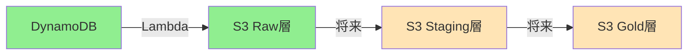
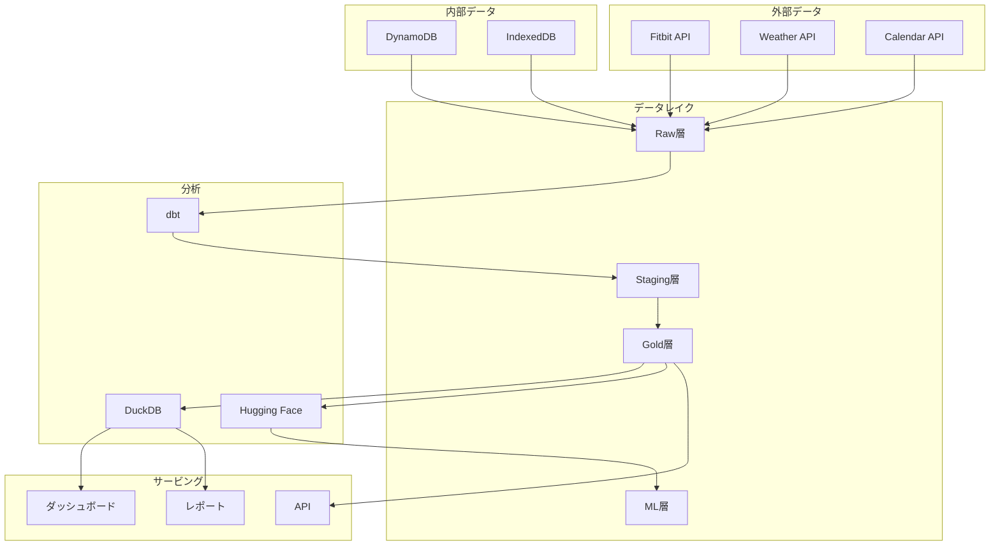

# データパイプライン ドキュメント

## 概要

ModerationCraftのデータパイプラインは、個人創作者の生産性と健康データを統合的に分析し、データドリブンな洞察を提供するシステムです。

## アーキテクチャ

```
データソース → Lambda → S3データレイク → dbt → DuckDB → ダッシュボード
```

### 主要コンポーネント

| コンポーネント | 説明 | 状態 |
|--------------|------|------|
| **DynamoDB** | アプリケーションデータストア | ✅ 稼働中 |
| **Lambda Functions** | データエクスポート処理 | ✅ 実装済み |
| **S3 Data Lake** | データレイク（raw/staging/gold層） | ✅ 構築済み |
| **EventBridge** | スケジュール実行（日次14:00 JST） | ✅ 設定済み |
| **dbt** | データ変換・モデリング | 🔄 Phase 3で実装予定 |
| **DuckDB** | 分析エンジン（WASM対応） | 🔄 Phase 3で実装予定 |
| **Hugging Face** | ML推論 | 🔄 Phase 4で実装予定 |

## 実装フェーズ

### Phase 1: 基盤構築 ✅ 完了（2024年2月）

**実装内容**:
- S3バケット作成とライフサイクル設定
- Lambda関数によるDynamoDB → S3エクスポート
- EventBridgeによる日次スケジュール実行
- アプリケーション統合（デバッグUI）

**成果物**:
- [実装計画書](./implementation-overview.md)
- [インフラ構築ガイド](./phase-1-infrastructure.md)
- [統合実装ガイド](./phase-1-integration.md)
- [技術仕様書](./technical-specifications.md)

**現在の機能**:
- ✅ 日次自動エクスポート（14:00 JST）
- ✅ 手動エクスポート実行
- ✅ エクスポート履歴表示
- ✅ データダウンロード機能
- ✅ デバッグUI（`/debug/pipeline`）

### Phase 2: 外部連携 🔄 次期実装

**計画内容**:
- Fitbit APIとのOAuth認証統合
- 天候データAPI（OpenWeatherMap）統合
- データ正規化パイプライン
- エラーハンドリングとリトライ機構

**ドキュメント**:
- [外部連携実装計画](./phase-2-external-integration.md)

### Phase 3: 分析基盤 📅 計画中

**計画内容**:
- dbtプロジェクト構築
- データマート作成（Gold層）
- DuckDB WASM統合
- ブラウザ内分析機能

**ドキュメント**:
- [分析基盤実装計画](./phase-3-analytics-foundation.md)

### Phase 4: 高度な分析 📅 計画中

**計画内容**:
- 相関分析の実装
- Hugging Face ML統合
- 予測モデル構築
- インタラクティブダッシュボード

**ドキュメント**:
- [高度な分析実装計画](./phase-4-advanced-analytics.md)

## データフロー

### 現在のデータフロー（Phase 1）



### 完全実装時のデータフロー



## S3データレイク構造

```
s3://moderation-craft-data-800860245583/
├── raw/                          # 生データ層
│   ├── internal/                 # 内部データ
│   │   └── dynamodb-exports/     # DynamoDBエクスポート
│   │       └── dt=YYYY-MM-DD/    # 日付パーティション
│   └── external/                 # 外部データ（Phase 2）
│       ├── fitbit/
│       └── weather/
├── staging/                      # 変換中間層（Phase 3）
├── gold/                        # 分析用データマート（Phase 3）
└── ml/                          # 機械学習用（Phase 4）
```

## 設定情報

### AWS リソース

| リソース | 名前/ID | 説明 |
|---------|---------|------|
| **S3 Bucket** | moderation-craft-data-800860245583 | データレイク |
| **Lambda Function** | moderation-craft-export-dynamodb | エクスポート処理 |
| **DynamoDB Table** | moderation-craft-data | ソースデータ |
| **IAM Role** | moderation-craft-lambda-role | Lambda実行ロール |
| **EventBridge Rule** | trigger-mc-daily-export | 日次スケジュール |

### スケジュール

- **日次エクスポート**: 毎日 14:00 JST (05:00 UTC)
- **cron式**: `cron(0 5 * * ? *)`

## クイックスタート

### 1. デバッグUIへアクセス

```
http://localhost:3000/debug/pipeline
```

### 2. 手動エクスポート実行

1. 「手動エクスポート」ボタンをクリック
2. 実行結果を確認
3. S3にデータが保存されたことを確認

### 3. エクスポート履歴確認

1. 「履歴」タブを開く
2. 過去のエクスポート一覧を確認
3. 必要に応じてデータをダウンロード

## API仕様

| エンドポイント | メソッド | 説明 |
|--------------|---------|------|
| `/api/pipeline/export` | POST | エクスポート実行 |
| `/api/pipeline/status` | GET | ステータス取得 |
| `/api/pipeline/latest` | GET | 最新データ取得 |

詳細は[技術仕様書](./technical-specifications.md)を参照。

## テスト

テスト戦略とテストコードについては[テスト戦略ドキュメント](./testing-strategy.md)を参照。

## トラブルシューティング

### CloudWatchログ確認

```bash
aws logs tail /aws/lambda/moderation-craft-export-dynamodb --follow
```

### S3データ確認

```bash
aws s3 ls s3://moderation-craft-data-800860245583/raw/internal/dynamodb-exports/ --recursive
```

### Lambda手動実行

```bash
aws lambda invoke \
  --function-name moderation-craft-export-dynamodb \
  --payload '{"tableName":"moderation-craft-data"}' \
  response.json
```

## 関連リンク

### 内部ドキュメント
- [機能説明書](/docs/features/pipeline-management.md)
- [CLAUDE.md](/CLAUDE.md) - プロジェクト全体のガイドライン

### 外部リソース
- [AWS Lambda Documentation](https://docs.aws.amazon.com/lambda/)
- [dbt Documentation](https://docs.getdbt.com/)
- [DuckDB Documentation](https://duckdb.org/docs/)

## コントリビューション

1. Phase 2以降の実装に参加する場合は、該当するフェーズのドキュメントを確認
2. 実装前に既存のコードとアーキテクチャを理解
3. テストを必ず作成
4. ドキュメントを更新

## ライセンス

ModerationCraftプロジェクトのライセンスに準拠

---

*最終更新: 2024年2月*
*次期更新予定: Phase 2実装開始時*