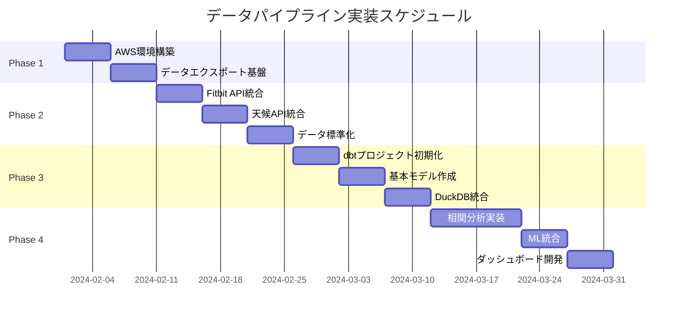

# データパイプライン実装計画書

## エグゼクティブサマリー

ModerationCraftのデータパイプライン構築プロジェクトは、個人創作者の生産性と健康データを統合的に分析し、データドリブンな洞察を提供するシステムを12週間で構築します。

## プロジェクト目標

### ビジネス目標
- 創作活動と健康状態の相関を可視化
- パーソナライズされた生産性向上提案の自動生成
- データに基づく最適な作業環境の提供

### 技術目標
- スケーラブルなデータパイプラインの構築
- リアルタイムとバッチ処理のハイブリッド実現
- オフライン対応の分析基盤確立

## 全体スケジュール

## フェーズ別概要

### Phase 1: 基盤構築（Week 1-2）
**目的**: AWSインフラストラクチャとデータエクスポート基盤の確立

**主要成果物**:
- S3データレイク構築完了
- Lambda関数フレームワーク
- DynamoDB → S3自動エクスポート
- CI/CDパイプライン

**成功基準**:
- [ ] S3バケットへの自動データ保存
- [ ] 日次エクスポートジョブの安定稼働

### Phase 2: 外部連携（Week 3-5）
**目的**: 外部データソースとの統合

**主要成果物**:
- Fitbit OAuth認証実装
- 天候データ取得パイプライン
- データ正規化処理
- エラーハンドリング機構

**成功基準**:
- [ ] 95%以上のデータ取得成功率
- [ ] 統一スキーマへの変換完了

### Phase 3: 分析基盤（Week 6-8）
**目的**: データ変換と分析環境の構築

**主要成果物**:
- dbtプロジェクト
- データマート（Gold層）
- DuckDB WASM統合
- 基本的な集計テーブル

**成功基準**:
- [ ] 日次・週次集計の自動化
- [ ] ブラウザ内での分析実行
- [ ] データ品質テストの合格率90%以上

### Phase 4: 高度な分析（Week 9-12）
**目的**: 機械学習と可視化の実装

**主要成果物**:
- 相関分析モデル
- Hugging Face統合
- インタラクティブダッシュボード
- 予測モデル

**成功基準**:
- [ ] 3つ以上の相関指標の算出
- [ ] 予測精度80%以上
- [ ] ダッシュボード応答時間2秒以内

## 依存関係マトリックス

| フェーズ | 前提条件 | 後続タスクへの影響 |
|---------|---------|-------------------|
| Phase 1 | AWSアカウント、DynamoDB実装済み | 全フェーズの基盤 |
| Phase 2 | Phase 1完了、API認証情報 | データ統合の前提 |
| Phase 3 | Phase 2完了、S3データ蓄積 | 分析機能の基盤 |
| Phase 4 | Phase 3完了、学習データ準備 | エンドユーザー機能 |

## 必要リソース

### 人的リソース
- **開発者**: 1-2名（フルスタック）
- **必要スキル**:
  - AWS（Lambda, S3, DynamoDB）
  - Python（データ処理）
  - TypeScript（フロントエンド統合）
  - SQL（dbt, DuckDB）

### インフラリソース
| サービス | 用途 | 予想月額コスト |
|---------|------|---------------|
| AWS S3 | データレイク | $10-20 |
| AWS Lambda | データ処理 | $5-10 |
| AWS Step Functions | オーケストレーション | $5-10 |
| Hugging Face | ML推論 | $0-10 |
| 外部API | データソース | $20-30 |
| **合計** | | **$40-80/月** |

### 開発ツール
- **必須**:
  - VS Code
  - AWS CLI
  - Python 3.9+
  - Node.js 18+
  - dbt Core

- **推奨**:
  - Docker Desktop
  - Postman
  - DBeaver

## リスクと軽減策

### 技術的リスク

| リスク | 影響度 | 発生確率 | 軽減策 |
|--------|-------|---------|--------|
| API レート制限 | 高 | 中 | キャッシュ実装、段階的取得 |
| データ品質問題 | 高 | 高 | バリデーション強化、異常値検知 |
| スケーラビリティ | 中 | 低 | パーティショニング、インデックス最適化 |
| 外部サービス障害 | 高 | 低 | リトライ機構、フォールバック |

### プロジェクトリスク

| リスク | 影響度 | 発生確率 | 軽減策 |
|--------|-------|---------|--------|
| スコープクリープ | 高 | 中 | MVP定義、段階的リリース |
| 技術的負債 | 中 | 高 | コードレビュー、リファクタリング時間確保 |
| 知識不足 | 中 | 中 | 学習時間確保、外部リソース活用 |

## 品質保証戦略

### コード品質
- **カバレッジ目標**: 80%以上
- **レビュープロセス**: PR必須
- **静的解析**: ESLint, Pylint

### データ品質
- **完全性チェック**: NULL値監視
- **整合性チェック**: 外部キー検証
- **適時性チェック**: 遅延アラート

### パフォーマンス基準
- **API応答時間**: < 500ms (p95)
- **バッチ処理時間**: < 30分/日
- **ダッシュボード読込**: < 3秒

## マイルストーンと判定基準

### Week 2: 基盤構築完了
- [ ] S3へのデータ保存成功
- [ ] Lambda関数のデプロイ完了

### Week 5: 外部連携完了
- [ ] 全APIとの接続確立
- [ ] データ正規化パイプライン稼働
- [ ] エラー率5%未満

### Week 8: 分析基盤完了
- [ ] dbtジョブの定期実行
- [ ] DuckDBクエリ実行成功
- [ ] 基本レポート生成

### Week 12: プロジェクト完了
- [ ] 全機能の本番稼働
- [ ] ドキュメント完成
- [ ] ユーザー受入テスト合格

## コミュニケーション計画

### 定例会議
- **週次進捗会議**: 毎週月曜 10:00
- **技術レビュー**: 毎週金曜 15:00

### 報告体系
- **日次**: Slackでの簡易報告
- **週次**: 進捗レポート作成
- **フェーズ終了時**: 成果物レビュー

### エスカレーションパス
1. 技術的課題 → テックリード
2. スコープ変更 → プロダクトオーナー
3. リソース問題 → プロジェクトマネージャー

## 成功の定義

### 定量的指標
- データパイプライン稼働率: 99%以上
- データ処理遅延: 1時間以内
- エラー率: 1%未満
- ユーザー満足度: 4.0/5.0以上

### 定性的指標
- 直感的なダッシュボード
- 実用的な洞察の提供
- 保守可能なコードベース
- 包括的なドキュメント

## 次のステップ

1. **即座に開始**:
   - AWSアカウントの設定確認
   - 必要な認証情報の取得
   - 開発環境のセットアップ

2. **Week 1の優先事項**:
   - S3バケットの作成
   - IAMロールの設定
   - 基本的なLambda関数の作成

3. **準備事項**:
   - 外部APIのアカウント作成
   - dbt Cloudアカウント設定（オプション）
   - 開発チームのオンボーディング

## 参考資料

- [AWS Well-Architected Framework](https://aws.amazon.com/architecture/well-architected/)
- [dbt Best Practices](https://docs.getdbt.com/guides/best-practices)
- [DuckDB Documentation](https://duckdb.org/docs/)
- [Hugging Face API Reference](https://huggingface.co/docs/api-inference/index)

---

*最終更新: 2024年2月*
*バージョン: 1.0*
*作成者: ModerationCraft開発チーム*
