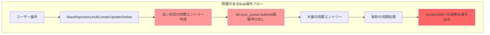
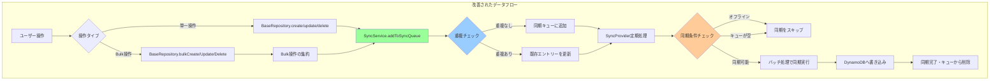
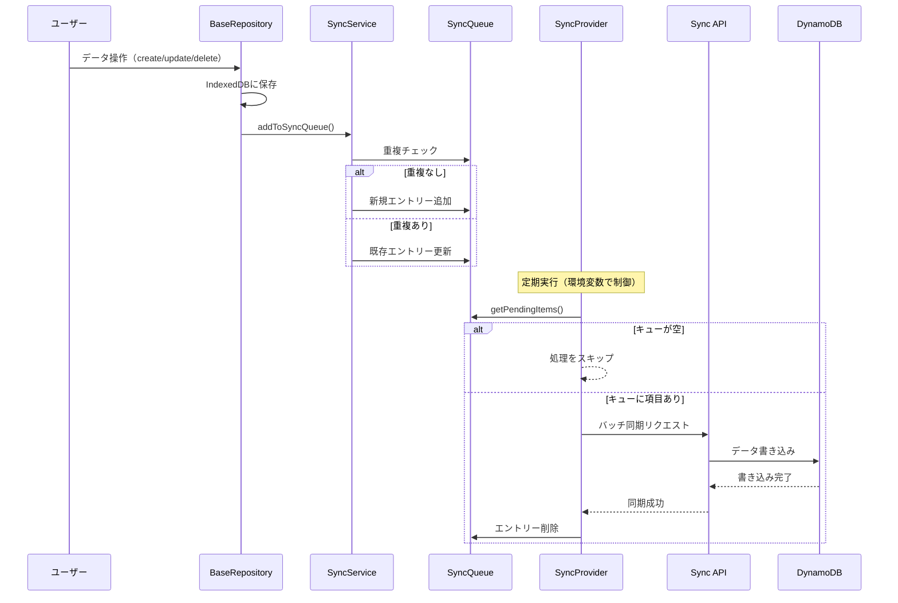
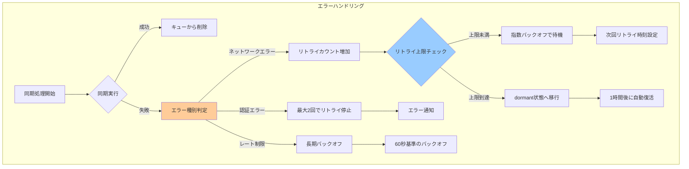
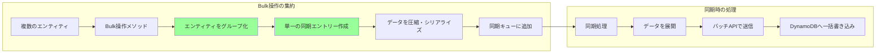
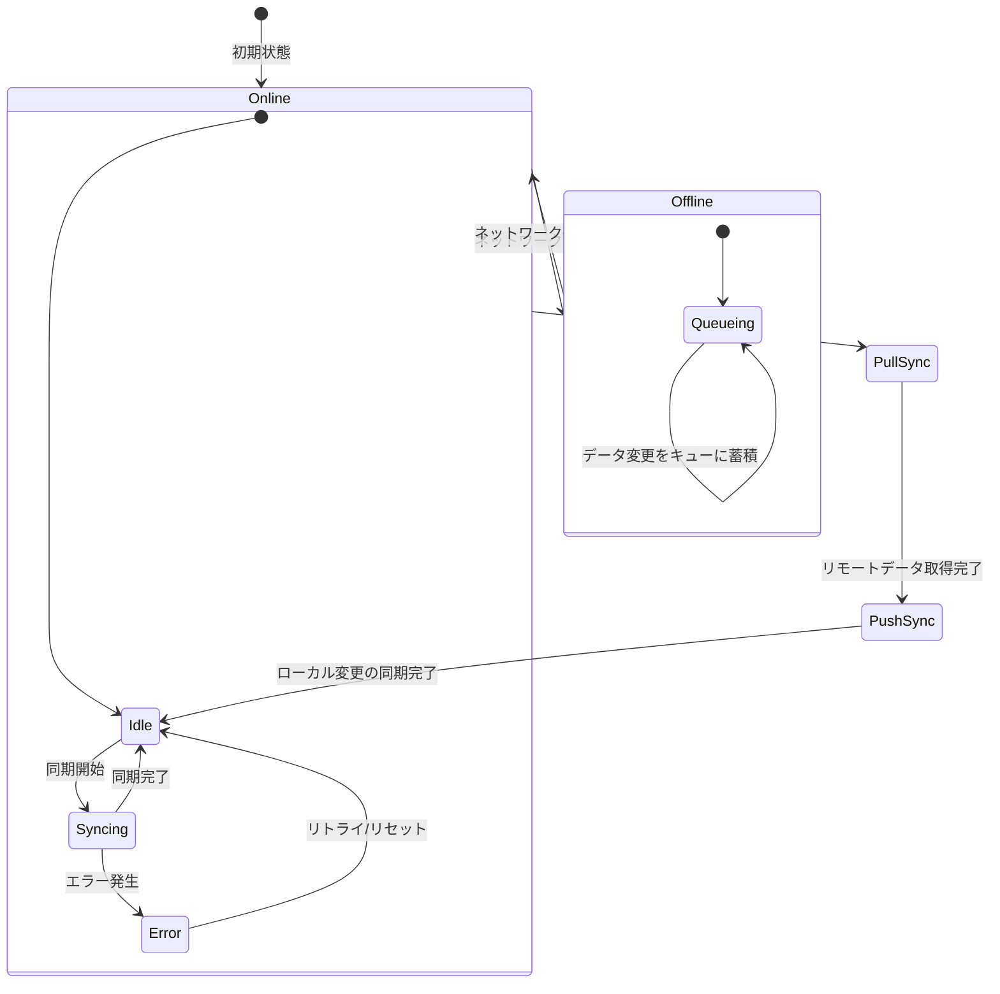
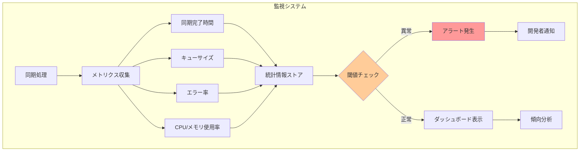

# データフロー図

## 現在の問題のあるフロー

```mermaid
flowchart TD
    subgraph "問題のあるBulk操作フロー"
        A1[ユーザー操作] --> B1[BaseRepository.bulkCreate/Update/Delete]
        B1 --> C1[古い形式の同期エントリー作成]
        C1 --> D1[db.sync_queue.bulkAdd直接呼び出し]
        D1 --> E1[大量の同期エントリー]
        E1 --> F1[毎秒の同期処理]
        F1 --> G1[DynamoDBへの過剰な書き込み]
    end
    
    style C1 fill:#ff9999
    style D1 fill:#ff9999
    style G1 fill:#ff6666
```

## 改善後のデータフロー

```mermaid
flowchart TD
    subgraph "改善されたデータフロー"
        A[ユーザー操作] --> B{操作タイプ}
        B -->|単一操作| C[BaseRepository.create/update/delete]
        B -->|Bulk操作| D[BaseRepository.bulkCreate/Update/Delete]
        
        C --> E[SyncService.addToSyncQueue]
        D --> F[Bulk操作の集約]
        F --> E
        
        E --> G{重複チェック}
        G -->|重複なし| H[同期キューに追加]
        G -->|重複あり| I[既存エントリーを更新]
        
        H --> J[SyncProvider定期処理]
        I --> J
        
        J --> K{同期条件チェック}
        K -->|オフライン| L[同期をスキップ]
        K -->|キューが空| L
        K -->|同期可能| M[バッチ処理で同期実行]
        
        M --> N[DynamoDBへ書き込み]
        N --> O[同期完了・キューから削除]
    end
    
    style E fill:#99ff99
    style G fill:#99ccff
    style K fill:#ffcc99
```

## 同期処理の詳細フロー

```mermaid
sequenceDiagram
    participant U as ユーザー
    participant BR as BaseRepository
    participant SS as SyncService
    participant SQ as SyncQueue
    participant SP as SyncProvider
    participant API as Sync API
    participant DB as DynamoDB
    
    U->>BR: データ操作（create/update/delete）
    BR->>BR: IndexedDBに保存
    BR->>SS: addToSyncQueue()
    
    SS->>SQ: 重複チェック
    alt 重複なし
        SS->>SQ: 新規エントリー追加
    else 重複あり
        SS->>SQ: 既存エントリー更新
    end
    
    Note over SP: 定期実行（環境変数で制御）
    
    SP->>SQ: getPendingItems()
    alt キューが空
        SP-->>SP: 処理をスキップ
    else キューに項目あり
        SP->>API: バッチ同期リクエスト
        API->>DB: データ書き込み
        DB-->>API: 書き込み完了
        API-->>SP: 同期成功
        SP->>SQ: エントリー削除
    end
```

## エラーハンドリングとリトライフロー

```mermaid
flowchart TD
    subgraph "エラーハンドリング"
        A[同期処理開始] --> B{同期実行}
        B -->|成功| C[キューから削除]
        B -->|失敗| D[エラー種別判定]
        
        D -->|ネットワークエラー| E[リトライカウント増加]
        D -->|認証エラー| F[最大2回でリトライ停止]
        D -->|レート制限| G[長期バックオフ]
        
        E --> H{リトライ上限チェック}
        H -->|上限未満| I[指数バックオフで待機]
        H -->|上限到達| J[dormant状態へ移行]
        
        I --> K[次回リトライ時刻設定]
        J --> L[1時間後に自動復活]
        
        F --> M[エラー通知]
        G --> N[60秒基準のバックオフ]
    end
    
    style D fill:#ffcc99
    style H fill:#99ccff
```

## Bulk操作の最適化フロー

```mermaid
flowchart LR
    subgraph "Bulk操作の集約"
        A[複数のエンティティ] --> B[Bulk操作メソッド]
        B --> C[エンティティをグループ化]
        C --> D[単一の同期エントリー作成]
        D --> E[データを圧縮・シリアライズ]
        E --> F[同期キューに追加]
    end
    
    subgraph "同期時の処理"
        F --> G[同期処理]
        G --> H[データを展開]
        H --> I[バッチAPIで送信]
        I --> J[DynamoDBへ一括書き込み]
    end
    
    style C fill:#99ff99
    style D fill:#99ff99
```

## オフライン/オンライン遷移フロー

```mermaid
stateDiagram-v2
    [*] --> Online: 初期状態
    
    Online --> Offline: ネットワーク切断検知
    Offline --> Online: ネットワーク復旧検知
    
    state Online {
        [*] --> Idle
        Idle --> Syncing: 同期開始
        Syncing --> Idle: 同期完了
        Syncing --> Error: エラー発生
        Error --> Idle: リトライ/リセット
    }
    
    state Offline {
        [*] --> Queueing
        Queueing --> Queueing: データ変更をキューに蓄積
    }
    
    Online --> PullSync: オンライン復帰時
    PullSync --> PushSync: リモートデータ取得完了
    PushSync --> Idle: ローカル変更の同期完了
```

## パフォーマンス監視フロー

```mermaid
flowchart TD
    subgraph "監視システム"
        A[同期処理] --> B[メトリクス収集]
        B --> C[同期完了時間]
        B --> D[キューサイズ]
        B --> E[エラー率]
        B --> F[CPU/メモリ使用率]
        
        C --> G[統計情報ストア]
        D --> G
        E --> G
        F --> G
        
        G --> H{閾値チェック}
        H -->|正常| I[ダッシュボード表示]
        H -->|異常| J[アラート発生]
        
        J --> K[開発者通知]
        I --> L[傾向分析]
    end
    
    style H fill:#ffcc99
    style J fill:#ff9999
```