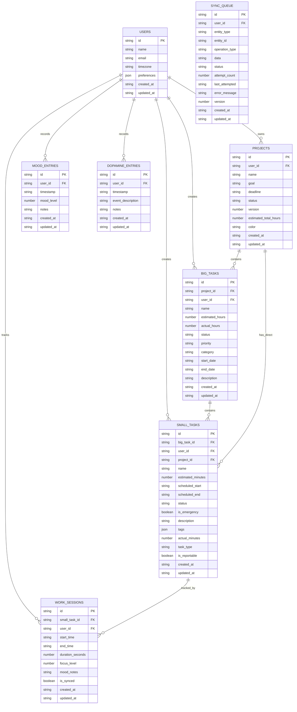

# ModerationCraft データベース設計（逆生成）

## スキーマ概要

### データベース構成
- **ローカルDB**: IndexedDB (Dexie v4)
- **クラウドDB**: AWS DynamoDB (NoSQL)
- **データベース名**: ModerationCraftDB

### テーブル一覧

#### IndexedDB テーブル
1. users - ユーザー情報
2. projects - プロジェクト
3. big_tasks - 大タスク（WBSレベル2）
4. small_tasks - 小タスク（実行可能タスク）
5. work_sessions - 作業セッション
6. mood_entries - 気分記録
7. dopamine_entries - ドーパミン記録
8. daily_conditions - 日次コンディション
9. category_colors - カテゴリカラー設定
10. schedule_memos - 週次スケジュールメモ
11. sleep_schedules - 睡眠スケジュール
12. sync_queue - 同期キュー

### ER図



## IndexedDB スキーマ詳細

### インデックス設定

```typescript
// Dexie スキーマ定義
{
  users: 'id, email, created_at, updated_at',
  projects: 'id, user_id, status, updated_at, deadline',
  big_tasks: 'id, project_id, user_id, week_number, status, updated_at',
  small_tasks: 'id, big_task_id, user_id, scheduled_start, scheduled_end, status, is_emergency, updated_at',
  work_sessions: 'id, small_task_id, user_id, start_time, end_time, is_synced, created_at',
  mood_entries: 'id, user_id, timestamp, mood_level, created_at',
  daily_conditions: 'id, date, user_id, fitbit_sync_date, created_at',
  sync_queue: 'id, user_id, entity_type, status, created_at, updated_at, [user_id+entity_type+entity_id]'
}
```

## DynamoDB スキーマ詳細

### テーブル構成
- **テーブル名**: moderation-craft-sync
- **課金モード**: PAY_PER_REQUEST（オンデマンド）

### プライマリキー設計
```
PK (Partition Key): USER#{userId}
SK (Sort Key): {ENTITY_TYPE}#{entityId}
```

### グローバルセカンダリインデックス（GSI）

#### user-time-index
- **PK**: user_time_pk
- **SK**: user_time_sk
- **用途**: 時系列データの効率的な取得

#### entity-type-index
- **PK**: entity_type
- **SK**: updated_at
- **用途**: エンティティタイプ別の最新データ取得

### キーパターン例

```typescript
// プロジェクト
PK: "USER#user_123"
SK: "PROJECT#proj_456"

// 大タスク
PK: "PROJECT#proj_456"
SK: "BIGTASK#task_789"

// 小タスク
PK: "BIGTASK#task_789"
SK: "SMALLTASK#small_012"

// ワークセッション
PK: "USER#user_123#DATE#2025-08-02"
SK: "SESSION#sess_345"
```

## データアクセスパターン

### よく使用されるクエリ

1. **ユーザーの全プロジェクト取得**
   ```
   Query: PK = "USER#{userId}" AND SK begins_with "PROJECT#"
   ```

2. **プロジェクトの全タスク取得**
   ```
   Query: PK = "PROJECT#{projectId}"
   ```

3. **特定日の作業セッション取得**
   ```
   Query: PK = "USER#{userId}#DATE#{date}"
   ```

4. **週次タスク取得**
   ```
   GSI Query: user_time_pk = "USER#{userId}#WEEK#{weekNumber}"
   ```

## 制約・関係性

### 外部キー制約（論理的）
- projects.user_id → users.id
- big_tasks.project_id → projects.id
- big_tasks.user_id → users.id
- small_tasks.big_task_id → big_tasks.id（NULL可）
- small_tasks.project_id → projects.id（NULL可）
- work_sessions.small_task_id → small_tasks.id（NULL可）

### ビジネスルール
1. プロジェクトのstatusは 'active' または 'completed'
2. タスクのstatusは 'pending'、'active'、'completed'、'cancelled'
3. 同期キューのstatusは 'pending'、'processing'、'completed'、'failed'
4. work_sessionのduration_secondsは0以上
5. mood_levelは数値（1-5の範囲を想定）

## パフォーマンス考慮事項

### IndexedDB最適化
- 複合インデックス: [user_id+entity_type+entity_id] で重複チェック高速化
- 日付ベースのインデックスで時系列クエリ最適化
- is_syncedフラグで未同期データの効率的な抽出

### DynamoDB最適化
- 階層的なキー設計でアクセスパターンに最適化
- GSIを使用して異なるアクセスパターンをサポート
- オンデマンド課金で柔軟なスケーリング

## データ同期戦略

### 同期キューの動作
1. ローカル操作時に同期キューにエントリ追加
2. バックグラウンドで定期的に未同期データをチェック
3. ネットワーク接続時に自動同期実行
4. 失敗時は指数バックオフでリトライ

### 競合解決
- バージョンフィールドによる楽観的ロック
- タイムスタンプベースの最終更新優先
- 削除済みデータの論理削除（ソフトデリート）