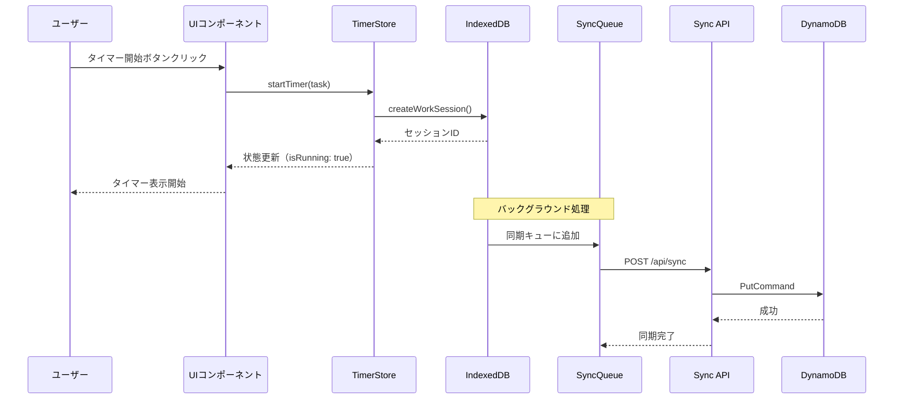
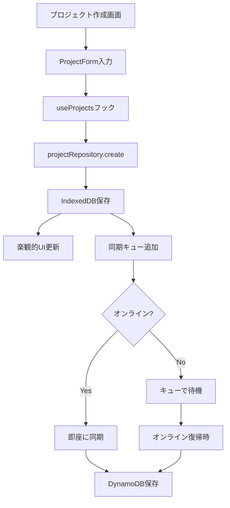
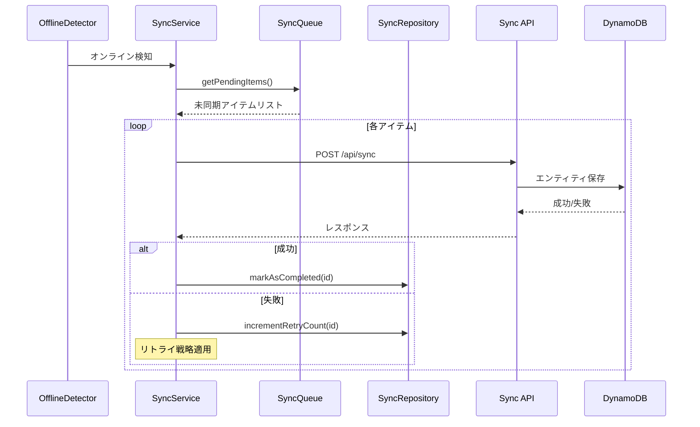
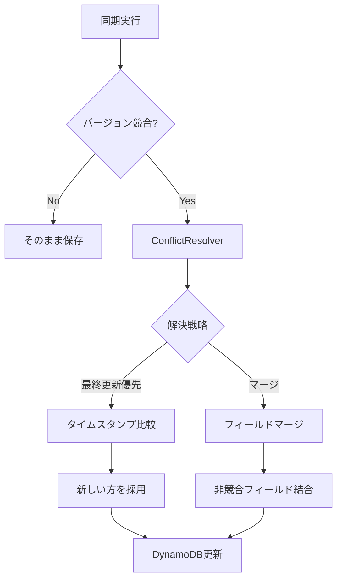
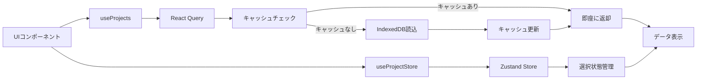
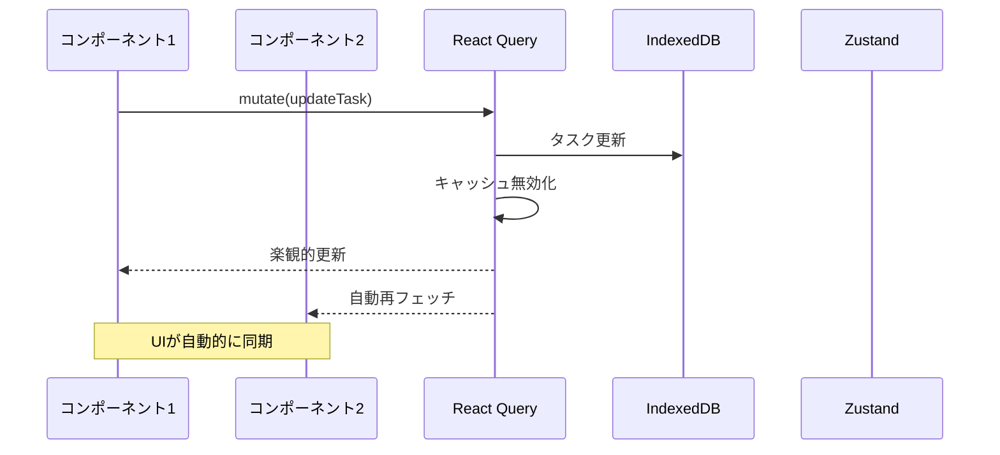
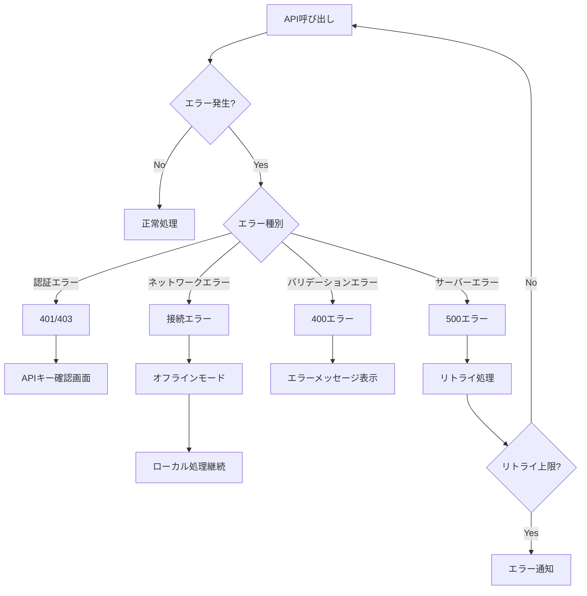
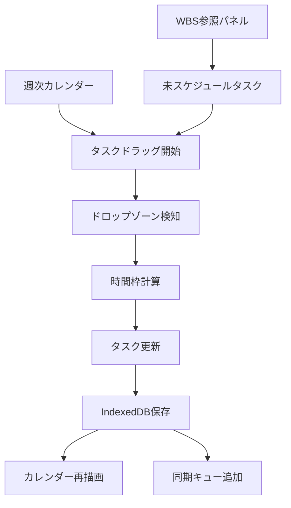
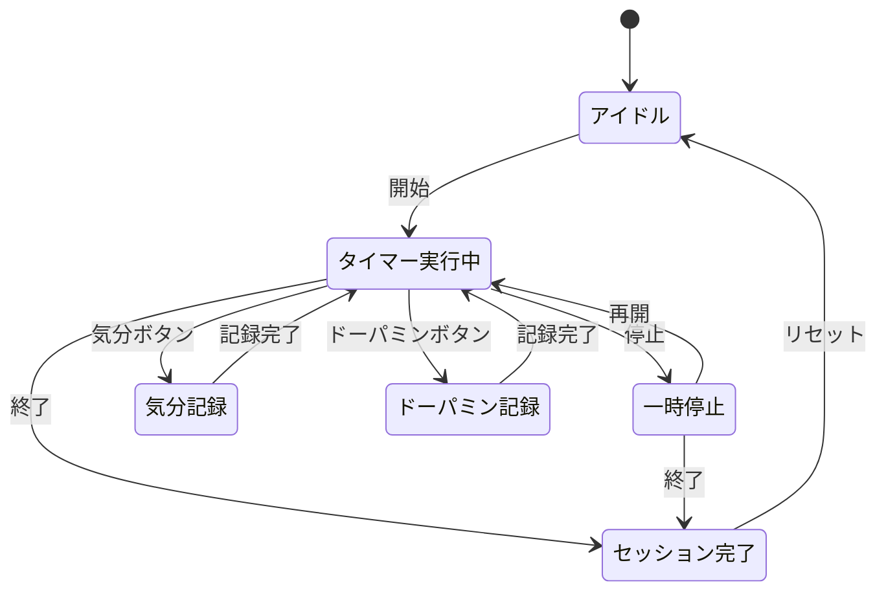

# ModerationCraft データフロー図（逆生成）

## ユーザーインタラクションフロー

### タイマー開始フロー

### プロジェクト作成フロー

## データ同期フロー

### オフライン→オンライン同期

### 競合解決フロー

## 状態管理フロー

### Zustand + React Query連携

### リアルタイム更新フロー

## エラーハンドリングフロー

## タスクスケジューリングフロー

## セッション管理フロー

