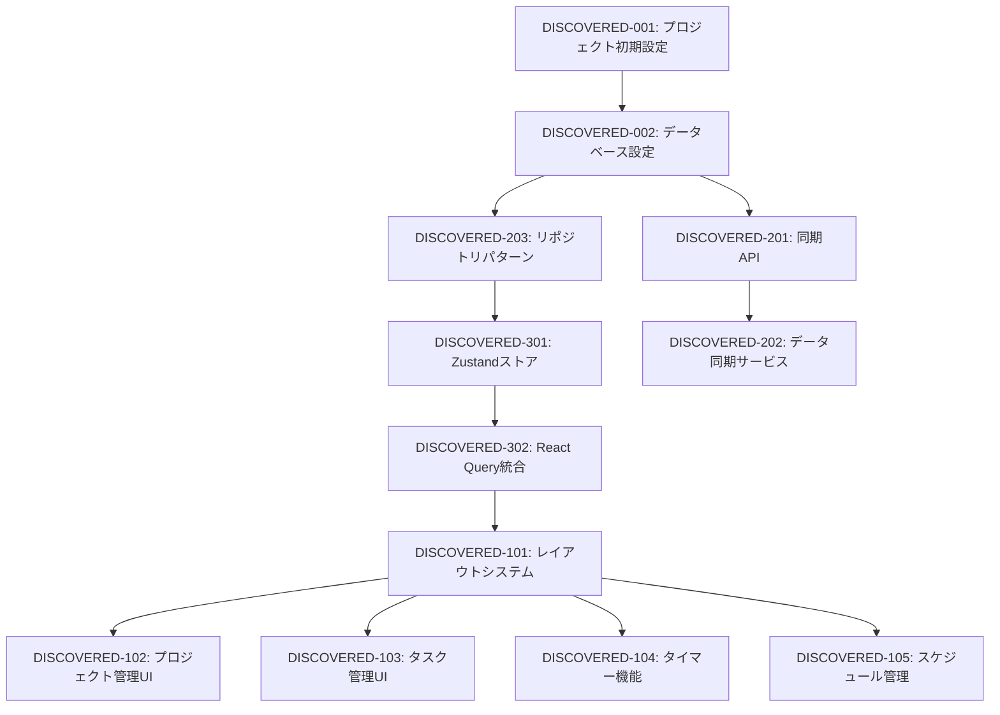

# ModerationCraft 発見タスク一覧

## 概要

**分析日時**: 2025-08-02
**対象コードベース**: /Users/junya/Dev/moderation-craft
**発見タスク数**: 75+
**推定総工数**: 800時間

## コードベース構造

### プロジェクト情報
- **フレームワーク**: Next.js 15.3.5 (App Router)
- **言語**: TypeScript 5
- **データベース**: IndexedDB (Dexie) + AWS DynamoDB
- **主要ライブラリ**: 
  - React 19
  - shadcn/ui v4
  - Tailwind CSS v4
  - React Query (TanStack Query v5)
  - Zustand v5
  - React Hook Form v7
  - Zod v3

### ディレクトリ構造
```
src/
├── app/                    # Next.js App Router ページ
│   ├── api/               # APIルート
│   ├── projects/          # プロジェクト管理
│   ├── reports/           # レポート機能
│   ├── schedule/          # スケジュール管理
│   └── timer/             # タイマー機能
├── components/            # Reactコンポーネント
│   ├── layout/           # レイアウト関連
│   ├── project/          # プロジェクト関連
│   ├── schedule/         # スケジュール関連
│   ├── task/             # タスク関連
│   ├── timer/            # タイマー関連
│   └── ui/               # shadcn/ui コンポーネント
├── hooks/                 # カスタムフック
├── lib/                   # ライブラリ・ユーティリティ
│   ├── api/              # API関連
│   ├── aws/              # AWS DynamoDB
│   ├── db/               # データベース
│   ├── sync/             # 同期機能
│   └── theme/            # テーマ関連
├── stores/                # Zustand ストア
└── types/                 # TypeScript型定義
```

## 発見されたタスク

### 基盤・設定タスク

#### DISCOVERED-001: プロジェクト初期設定

- [x] **タスク完了** (実装済み)
- **タスクタイプ**: DIRECT
- **実装ファイル**: 
  - `package.json`
  - `tsconfig.json`
  - `tailwind.config.ts`
  - `next.config.js`
- **実装詳細**:
  - Next.js 15.3.5 with App Router
  - TypeScript strict mode 設定
  - Tailwind CSS v4 設定
  - 71個の本番依存関係
  - 31個の開発依存関係
- **推定工数**: 16時間

#### DISCOVERED-002: データベース設定

- [x] **タスク完了** (実装済み)
- **タスクタイプ**: TDD
- **実装ファイル**: 
  - `src/lib/db/database.ts`
  - `src/lib/aws/dynamodb-client.ts`
  - `src/lib/aws/dynamodb-schema.ts`
- **実装詳細**:
  - Dexie (IndexedDB) によるローカルストレージ
  - 12のエンティティテーブル定義
  - AWS DynamoDB クライアント設定
  - オフラインファースト設計
- **推定工数**: 24時間

### UI/UX実装タスク

#### DISCOVERED-101: レイアウトシステム

- [x] **タスク完了** (実装済み)
- **タスクタイプ**: TDD
- **実装ファイル**: 
  - `src/components/layout/main-layout.tsx`
  - `src/components/layout/sidebar/app-sidebar.tsx`
  - `src/components/layout/header.tsx`
- **実装詳細**:
  - サイドバーナビゲーション
  - レスポンシブレイアウト
  - テーマ切り替え機能
- **テスト実装状況**:
  - [x] 単体テスト: `app-sidebar.test.tsx`
  - [x] 単体テスト: `nav-main.test.tsx`
  - [x] 単体テスト: `nav-user.test.tsx`
- **推定工数**: 32時間

#### DISCOVERED-102: プロジェクト管理UI

- [x] **タスク完了** (実装済み)
- **タスクタイプ**: TDD
- **実装ファイル**: 
  - `src/components/project/project-list.tsx`
  - `src/components/project/project-card.tsx`
  - `src/components/project/project-form.tsx`
  - `src/components/project/project-delete-dialog.tsx`
- **実装詳細**:
  - プロジェクト一覧表示（グリッド/リスト切替）
  - プロジェクト作成・編集フォーム
  - カラーピッカー機能
  - 削除確認ダイアログ
  - フィルタリング・ソート機能
  - ページネーション
- **推定工数**: 40時間

#### DISCOVERED-103: タスク管理UI

- [x] **タスク完了** (実装済み)
- **タスクタイプ**: TDD
- **実装ファイル**: 
  - `src/components/task/big-task-list.tsx`
  - `src/components/task/big-task-form.tsx`
  - `src/components/task/small-task-list.tsx`
  - `src/components/task/small-task-form.tsx`
- **実装詳細**:
  - 大タスク・小タスクの階層管理
  - タスクステータス管理
  - 推定時間・実績時間の記録
  - カテゴリ分類
- **Storybook実装**:
  - [x] `big-task-form.stories.tsx`
  - [x] `big-task-list.stories.tsx`
- **推定工数**: 48時間

#### DISCOVERED-104: タイマー機能

- [x] **タスク完了** (実装済み)
- **タスクタイプ**: TDD
- **実装ファイル**: 
  - `src/components/timer/timer-controls.tsx`
  - `src/components/timer/timer-task-display.tsx`
  - `src/components/timer/work-session-list.tsx`
  - `src/components/timer/combined-schedule-view.tsx`
- **実装詳細**:
  - ポモドーロタイマー実装
  - 作業セッション記録
  - タスクとの紐付け
  - 気分・ドーパミン記録機能
  - 日次スケジュール表示
- **テスト実装状況**:
  - [x] 単体テスト: `combined-schedule-view.test.tsx`
  - [x] 単体テスト: `task-card.test.tsx`
  - [x] ページテスト: `page.test.tsx`
- **推定工数**: 56時間

#### DISCOVERED-105: スケジュール管理

- [x] **タスク完了** (実装済み)
- **タスクタイプ**: TDD
- **実装ファイル**: 
  - `src/components/schedule/weekly-calendar.tsx`
  - `src/components/schedule/task-create-dialog.tsx`
  - `src/components/schedule/task-detail-dialog.tsx`
  - `src/components/schedule/wbs-reference-panel.tsx`
- **実装詳細**:
  - 週次カレンダービュー
  - ドラッグ&ドロップによるタスク配置
  - タスク詳細編集
  - WBS参照パネル
  - 睡眠スケジュール設定
- **テスト実装状況**:
  - [x] 単体テスト: `task-memo.test.tsx`
- **推定工数**: 64時間

### バックエンド実装タスク

#### DISCOVERED-201: 同期API実装

- [x] **タスク完了** (実装済み)
- **タスクタイプ**: TDD
- **実装ファイル**: 
  - `src/app/api/sync/route.ts`
  - `src/app/api/sync/pull/route.ts`
  - `src/app/api/sync/check/route.ts`
- **実装詳細**:
  - RESTful API設計
  - CREATE/UPDATE/DELETE操作
  - APIキー認証
  - エラーハンドリング
- **APIエンドポイント**:
  - `POST /api/sync` - データ同期
  - `POST /api/sync/pull` - データ取得
  - `GET /api/sync/check` - 同期ステータス確認
  - `GET /api/health` - ヘルスチェック
- **推定工数**: 40時間

#### DISCOVERED-202: データ同期サービス

- [x] **タスク完了** (実装済み)
- **タスクタイプ**: TDD
- **実装ファイル**: 
  - `src/lib/sync/sync-service.ts`
  - `src/lib/sync/conflict-resolver.ts`
  - `src/lib/sync/offline-detector.ts`
  - `src/lib/sync/retry-strategy.ts`
- **実装詳細**:
  - オフラインファースト設計
  - 楽観的更新
  - 競合解決アルゴリズム
  - 自動リトライ機能
  - 同期キュー管理
- **推定工数**: 48時間

#### DISCOVERED-203: リポジトリパターン実装

- [x] **タスク完了** (実装済み)
- **タスクタイプ**: TDD
- **実装ファイル**: 
  - `src/lib/db/repositories/base-repository.ts`
  - `src/lib/db/repositories/project-repository.ts`
  - `src/lib/db/repositories/task-repository.ts`
  - 他8つのリポジトリファイル
- **実装詳細**:
  - 基底リポジトリクラス
  - CRUD操作の抽象化
  - トランザクション対応
  - エラーハンドリング
- **テスト実装状況**:
  - [x] 単体テスト: `base-repository.test.ts`
- **推定工数**: 32時間

### 状態管理実装タスク

#### DISCOVERED-301: Zustandストア実装

- [x] **タスク完了** (実装済み)
- **タスクタイプ**: DIRECT
- **実装ファイル**: 
  - `src/stores/project-store.ts`
  - `src/stores/task-store.ts`
  - `src/stores/timer-store.ts`
  - `src/stores/sync-store.ts`
  - `src/stores/project-creation-store.ts`
- **実装詳細**:
  - グローバル状態管理
  - 永続化対応
  - TypeScript型安全性
- **推定工数**: 24時間

#### DISCOVERED-302: React Query統合

- [x] **タスク完了** (実装済み)
- **タスクタイプ**: TDD
- **実装ファイル**: 
  - `src/lib/query/query-client.ts`
  - `src/hooks/use-projects.ts`
  - `src/hooks/use-tasks.ts`
  - 他10個のカスタムフック
- **実装詳細**:
  - サーバー状態管理
  - キャッシュ戦略
  - 楽観的更新
  - 無限スクロール対応
- **推定工数**: 32時間

### UI コンポーネントライブラリ

#### DISCOVERED-401: shadcn/ui統合

- [x] **タスク完了** (実装済み)
- **タスクタイプ**: DIRECT
- **実装ファイル**: 
  - 40+ UIコンポーネントファイル in `src/components/ui/`
- **実装詳細**:
  - Button, Card, Dialog, Form等の基本コンポーネント
  - データテーブル、カレンダー等の複雑なコンポーネント
  - セマンティックカラーシステム
  - アクセシビリティ対応
- **推定工数**: 40時間

## 未実装・改善推奨事項

### 不足しているテスト

- [ ] **E2Eテストスイート**: Playwright設定はあるが未実装
- [ ] **統合テスト**: API統合テストの不足
- [ ] **カバレッジ向上**: 現在のテストカバレッジが低い

### セキュリティ強化

- [ ] **認証システム**: 現在APIキーのみ、OAuth等の実装推奨
- [ ] **データ暗号化**: センシティブデータの暗号化
- [ ] **CSRF対策**: トークンベースのCSRF保護

### パフォーマンス最適化

- [ ] **バンドルサイズ**: 依存関係が多く最適化余地あり
- [ ] **画像最適化**: Next.js Image最適化の活用
- [ ] **コード分割**: 動的インポートの活用

### ドキュメント不足

- [ ] **API仕様書**: OpenAPI/Swagger未実装
- [ ] **開発者ガイド**: セットアップ・開発手順書
- [ ] **アーキテクチャ文書**: システム設計書

## 依存関係マップ



## 実装パターン分析

### アーキテクチャパターン
- **実装パターン**: レイヤードアーキテクチャ + オフラインファースト
- **状態管理**: Zustand (ローカル) + React Query (サーバー)
- **データアクセス**: リポジトリパターン
- **同期方式**: 楽観的更新 + キュー管理

### コーディングスタイル
- **命名規則**: camelCase (変数・関数)、PascalCase (型・コンポーネント)
- **ファイル構成**: 機能別ディレクトリ構成
- **エラーハンドリング**: try-catch + カスタムエラークラス
- **型安全性**: strict mode + Zod バリデーション

## 技術的負債・改善点

### パフォーマンス
- 大量データ時のレンダリング最適化が必要
- バンドルサイズの削減余地あり
- 画像・アセット最適化の改善

### セキュリティ
- 認証システムの強化が必要
- APIレート制限の実装
- セキュリティヘッダーの設定

### 保守性
- テストカバレッジの向上
- エラー監視システムの導入
- CI/CDパイプラインの構築

## 推奨次ステップ

1. **E2Eテストの実装** - Playwrightを使用した主要フローのテスト
2. **認証システムの強化** - NextAuth.js等の導入検討
3. **ドキュメント整備** - API仕様書、開発ガイドの作成
4. **パフォーマンス最適化** - バンドルサイズ削減、レンダリング最適化
5. **監視・分析基盤** - エラートラッキング、使用状況分析の導入