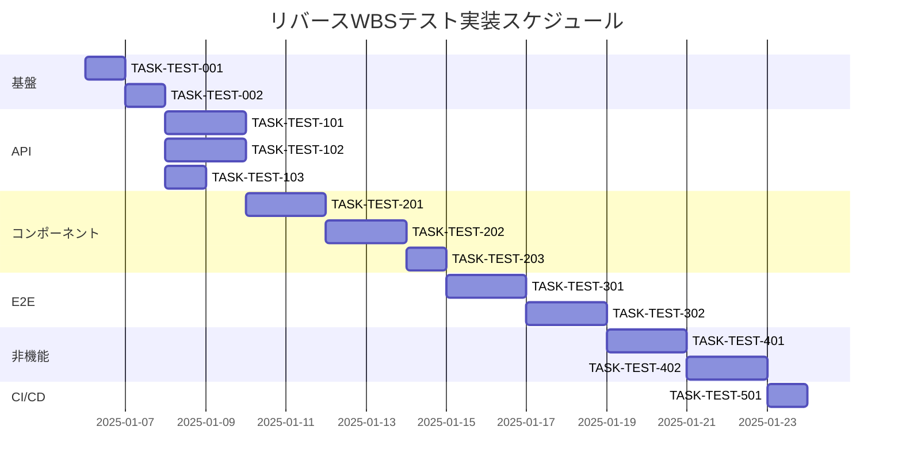

# リバースWBS機能 テスト実装タスク

## 概要

全タスク数: 25
推定作業時間: 86時間
クリティカルパス: TASK-TEST-001 → TASK-TEST-002 → TASK-TEST-101 → TASK-TEST-201

## タスク一覧

### フェーズ1: テスト基盤構築

#### TASK-TEST-001: テスト環境初期設定

- [ ] **タスク完了**
- **タスクタイプ**: DIRECT
- **要件リンク**: 全テスト要件
- **依存タスク**: なし
- **実装詳細**:
  - Vitestの設定更新（vitest.config.ts）
  - MSW（Mock Service Worker）のセットアップ
  - テストユーティリティの作成
  - カバレッジ設定の調整
- **テスト要件**:
  - [ ] テスト実行確認
  - [ ] カバレッジレポート生成確認
- **完了条件**:
  - [ ] `npm test`でテストが実行される
  - [ ] カバレッジレポートが生成される
  - [ ] MSWでAPIモックが動作する

#### TASK-TEST-002: テストデータファクトリー作成

- [ ] **タスク完了**
- **タスクタイプ**: TDD
- **要件リンク**: 全テスト要件
- **依存タスク**: TASK-TEST-001
- **実装詳細**:
  - リバースWBS用テストデータ生成
  - 目標、タスク、依存関係のファクトリー
  - ランダムデータ生成ユーティリティ
- **テスト要件**:
  - [ ] 各ファクトリー関数の単体テスト
  - [ ] データ整合性の検証
- **完了条件**:
  - [ ] 全エンティティのファクトリーが作成される
  - [ ] テストで簡単に使用できる

### フェーズ2: API統合テスト実装

#### TASK-TEST-101: AI提案生成APIテスト

- [ ] **タスク完了**
- **タスクタイプ**: TDD
- **要件リンク**: REQ-001, REQ-101
- **依存タスク**: TASK-TEST-002
- **実装詳細**:
  - POST /api/reverse-wbs/suggest の正常系テスト
  - エラーハンドリングテスト
  - タイムアウトテスト
  - 不適切な入力の検証
- **テスト要件**:
  - [ ] 正常系: 有効な目標でタスク生成
  - [ ] 異常系: 空入力、長すぎる入力
  - [ ] 性能: 3秒以内の応答確認
- **エラーハンドリング**:
  - [ ] ネットワークエラー
  - [ ] AI API利用不可
  - [ ] レート制限

#### TASK-TEST-102: 依存関係検証APIテスト

- [ ] **タスク完了**
- **タスクタイプ**: TDD
- **要件リンク**: REQ-005, REQ-103
- **依存タスク**: TASK-TEST-002
- **実装詳細**:
  - POST /api/reverse-wbs/validate の実装
  - 循環依存検出ロジックのテスト
  - 複雑な依存関係パターンの検証
- **テスト要件**:
  - [ ] 単純な依存関係の検証
  - [ ] 循環依存の検出
  - [ ] 多階層依存関係の処理
- **完了条件**:
  - [ ] 全ての依存関係パターンがテストされる
  - [ ] パフォーマンスが基準内

#### TASK-TEST-103: プロジェクト変換APIテスト

- [ ] **タスク完了**
- **タスクタイプ**: TDD
- **要件リンク**: REQ-006
- **依存タスク**: TASK-TEST-002
- **実装詳細**:
  - POST /api/reverse-wbs/convert のテスト
  - WBSからプロジェクト構造への変換
  - データ整合性の確認
- **テスト要件**:
  - [ ] 正常な変換処理
  - [ ] 大規模データの変換
  - [ ] エラー時のロールバック

### フェーズ3: コンポーネント単体テスト

#### TASK-TEST-201: ReverseWBSFormコンポーネントテスト

- [ ] **タスク完了**
- **タスクタイプ**: TDD
- **要件リンク**: REQ-001
- **依存タスク**: TASK-TEST-101
- **実装詳細**:
  - 目標入力フォームの表示テスト
  - バリデーションテスト
  - 送信処理のテスト
- **UI/UX要件**:
  - [ ] ローディング状態: スピナー表示
  - [ ] エラー表示: インラインエラーメッセージ
  - [ ] モバイル対応: レスポンシブレイアウト
  - [ ] アクセシビリティ: ARIA属性、フォーカス管理
- **テスト要件**:
  - [ ] レンダリングテスト
  - [ ] ユーザー操作テスト
  - [ ] 状態管理テスト

#### TASK-TEST-202: TaskHierarchyEditorテスト

- [ ] **タスク完了**
- **タスクタイプ**: TDD
- **要件リンク**: REQ-002, REQ-202
- **依存タスク**: TASK-TEST-201
- **実装詳細**:
  - タスク階層表示のテスト
  - ドラッグ&ドロップ機能テスト
  - 編集機能のテスト
- **UI/UX要件**:
  - [ ] ドラッグ中の視覚フィードバック
  - [ ] ドロップ可能領域のハイライト
  - [ ] アニメーション効果
- **テスト要件**:
  - [ ] 階層構造の正しい表示
  - [ ] インタラクション動作
  - [ ] データ更新の反映

#### TASK-TEST-203: DependencyGraphテスト

- [ ] **タスク完了**
- **タスクタイプ**: TDD
- **要件リンク**: REQ-005
- **依存タスク**: TASK-TEST-202
- **実装詳細**:
  - 依存関係グラフの描画テスト
  - インタラクティブ機能のテスト
  - パフォーマンステスト
- **テスト要件**:
  - [ ] グラフ描画の正確性
  - [ ] ユーザー操作の応答
  - [ ] 大規模データでの性能

### フェーズ4: E2Eテスト実装

#### TASK-TEST-301: 基本フローE2Eテスト

- [ ] **タスク完了**
- **タスクタイプ**: TDD
- **要件リンク**: 全ユーザーストーリー
- **依存タスク**: TASK-TEST-203
- **実装詳細**:
  - Playwright設定
  - 目標入力→AI提案→編集→保存の完全フロー
  - スクリーンショット取得
- **テスト要件**:
  - [ ] 正常フローの完走
  - [ ] 各ステップでの検証
  - [ ] クロスブラウザテスト

#### TASK-TEST-302: オフライン動作E2Eテスト

- [ ] **タスク完了**
- **タスクタイプ**: TDD
- **要件リンク**: REQ-101, REQ-102
- **依存タスク**: TASK-TEST-301
- **実装詳細**:
  - オフライン状態のシミュレーション
  - ローカル保存の確認
  - オンライン復帰時の同期確認
- **テスト要件**:
  - [ ] オフライン検知
  - [ ] データ永続化
  - [ ] 自動同期処理

### フェーズ5: 非機能テスト

#### TASK-TEST-401: パフォーマンステストスイート

- [ ] **タスク完了**
- **タスクタイプ**: DIRECT
- **要件リンク**: NFR-001, NFR-002, NFR-003
- **依存タスク**: TASK-TEST-302
- **実装詳細**:
  - 負荷テストシナリオ作成
  - 応答時間測定
  - メモリ使用量監視
- **テスト要件**:
  - [ ] AI提案3秒以内
  - [ ] 1000タスク表示1秒以内
  - [ ] 60fps維持確認

#### TASK-TEST-402: セキュリティテストスイート

- [ ] **タスク完了**
- **タスクタイプ**: TDD
- **要件リンク**: NFR-101, NFR-102
- **依存タスク**: TASK-TEST-401
- **実装詳細**:
  - XSS脆弱性テスト
  - インジェクション攻撃テスト
  - 認証・認可テスト
- **テスト要件**:
  - [ ] 一般的な攻撃パターンの検証
  - [ ] データ漏洩防止確認
  - [ ] 暗号化確認

### フェーズ6: CI/CD統合

#### TASK-TEST-501: GitHub Actions設定

- [ ] **タスク完了**
- **タスクタイプ**: DIRECT
- **要件リンク**: 全テスト要件
- **依存タスク**: TASK-TEST-402
- **実装詳細**:
  - テストワークフロー作成
  - カバレッジレポート統合
  - 自動マージ条件設定
- **完了条件**:
  - [ ] PRごとにテスト実行
  - [ ] カバレッジ表示
  - [ ] 失敗時のブロック

## 実行順序

## サブタスクテンプレート

### TDDタスクの場合

各テストタスクは以下のTDDプロセスで実装:

1. **要件分析** (`tdd-requirements.md`)
   - テスト対象の詳細要件確認
   - 受け入れ基準の明確化

2. **テストケース設計** (`tdd-testcases.md`)
   - 正常系・異常系のケース列挙
   - テストデータの準備

3. **レッドフェーズ** (`tdd-red.md`)
   - 失敗するテストの実装
   - エラーメッセージの確認

4. **グリーンフェーズ** (`tdd-green.md`)
   - 最小限の実装でテストを通す
   - リファクタリングは行わない

5. **リファクタリング** (`tdd-refactor.md`)
   - コードの品質改善
   - パフォーマンス最適化

6. **完了確認** (`tdd-verify-complete.md`)
   - カバレッジ確認
   - ドキュメント更新

### DIRECTタスクの場合

設定・環境構築タスクは以下のプロセスで実装:

1. **セットアップ** (`direct-setup.md`)
   - 設定ファイルの作成/更新
   - 依存関係のインストール

2. **動作確認** (`direct-verify.md`)
   - 設定の検証
   - サンプル実行

## リスク管理

### 技術的リスク
1. **Playwright環境構築の複雑さ**
   - 対策: Dockerコンテナ使用
   - バッファ: +2時間

2. **AIモックの作成難易度**
   - 対策: 実APIレスポンスをキャプチャ
   - バッファ: +4時間

3. **パフォーマンステストの不安定性**
   - 対策: 複数回実行と統計処理
   - バッファ: +2時間

### スケジュールリスク
- 総バッファ時間: 8時間（約10%）
- 週次進捗確認
- 遅延時は低優先度タスクを次スプリントへ

## 成果物

1. **テストコード** (src/__tests__/reverse-wbs/)
2. **テストドキュメント** (docs/test/)
3. **CI/CD設定** (.github/workflows/)
4. **カバレッジレポート** (coverage/)

## 完了定義

- [ ] 全タスクのステータスが「completed」
- [ ] カバレッジ目標80%達成
- [ ] CI/CDパイプライン安定稼働
- [ ] ドキュメント更新完了