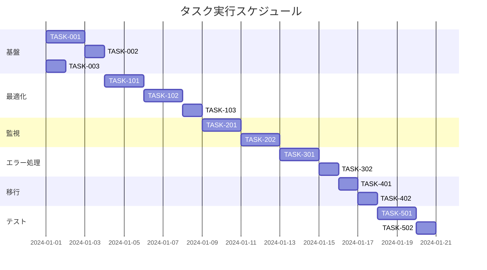

# 同期パフォーマンス問題 実装タスク

## 概要

全タスク数: 15
推定作業時間: 24時間
クリティカルパス: TASK-001 → TASK-002 → TASK-003 → TASK-101 → TASK-201 → TASK-301

## タスク一覧

### フェーズ1: 基盤構築

#### TASK-001: BaseRepositoryのbulk操作メソッド修正

- [ ] **タスク完了**
- **タスクタイプ**: TDD
- **要件リンク**: REQ-002, REQ-104
- **依存タスク**: なし
- **実装詳細**:
  - bulkCreate、bulkUpdate、bulkDeleteメソッドの修正
  - 古い同期キュー形式の削除
  - SyncService.addToSyncQueue()の統合
  - bulk操作の集約処理実装
- **テスト要件**:
  - [ ] 単体テスト: bulk操作が正しく同期キューに追加されることを確認
  - [ ] 単体テスト: 古い形式の同期エントリーが作成されないことを確認
  - [ ] 統合テスト: bulk操作後の同期処理が正常に動作することを確認
- **完了条件**:
  - [ ] bulkCreateが新しい同期サービスを使用している
  - [ ] bulkUpdateが新しい同期サービスを使用している
  - [ ] bulkDeleteが新しい同期サービスを使用している
  - [ ] 古い形式のdb.sync_queue.bulkAdd()が削除されている

#### TASK-002: 同期キュー重複チェック機能の実装

- [ ] **タスク完了**
- **タスクタイプ**: TDD
- **要件リンク**: REQ-003
- **依存タスク**: TASK-001
- **実装詳細**:
  - SyncQueueRepositoryに重複チェックメソッドを追加
  - 複合インデックスの実装（entity_type + entity_id + operation_type）
  - 既存エントリーの更新ロジック
- **テスト要件**:
  - [ ] 単体テスト: 重複エントリーが作成されないことを確認
  - [ ] 単体テスト: 既存エントリーが適切に更新されることを確認
  - [ ] パフォーマンステスト: 重複チェックが高速に動作することを確認
- **完了条件**:
  - [ ] findExistingItem()メソッドが実装されている
  - [ ] 重複時は新規作成ではなく更新が行われる
  - [ ] 複合インデックスが設定されている

#### TASK-003: 同期間隔の環境変数制御

- [ ] **タスク完了**
- **タスクタイプ**: DIRECT
- **要件リンク**: REQ-004
- **依存タスク**: なし
- **実装詳細**:
  - env.tsファイルの更新
  - SYNC_INTERVAL_MSのデフォルト値設定（30秒）
  - SyncProviderでの環境変数読み込み
- **テスト要件**:
  - [ ] 環境変数が正しく読み込まれることを確認
  - [ ] デフォルト値が適用されることを確認
- **完了条件**:
  - [ ] 環境変数NEXT_PUBLIC_SYNC_INTERVAL_MSが定義されている
  - [ ] SyncProviderが環境変数を使用している
  - [ ] デフォルト値（30000ms）が設定されている

### フェーズ2: 同期処理の最適化

#### TASK-101: 同期条件チェックの実装

- [ ] **タスク完了**
- **タスクタイプ**: TDD
- **要件リンク**: REQ-101, REQ-103, REQ-201
- **依存タスク**: TASK-001, TASK-002, TASK-003
- **実装詳細**:
  - オフライン検知時の同期スキップ
  - 空キューでの処理スキップ
  - 同期中フラグによる重複実行防止
- **テスト要件**:
  - [ ] 単体テスト: オフライン時に同期がスキップされることを確認
  - [ ] 単体テスト: 空キューで同期がスキップされることを確認
  - [ ] 単体テスト: 同期中に新たな同期が開始されないことを確認
- **エラーハンドリング**:
  - [ ] ネットワークエラーの適切な処理
  - [ ] 同期状態の正確な管理
- **完了条件**:
  - [ ] canSync()メソッドが実装されている
  - [ ] 各種条件でのスキップが動作している

#### TASK-102: リトライメカニズムの改善

- [ ] **タスク完了**
- **タスクタイプ**: TDD
- **要件リンク**: REQ-102, EDGE-001, EDGE-002, EDGE-103
- **依存タスク**: TASK-101
- **実装詳細**:
  - エラータイプ別のリトライ戦略
  - 指数バックオフの実装
  - dormant状態の管理
  - 自動復活メカニズム
- **テスト要件**:
  - [ ] 単体テスト: ネットワークエラー時のリトライ動作
  - [ ] 単体テスト: 認証エラー時の適切な停止
  - [ ] 単体テスト: レート制限時の長期バックオフ
  - [ ] 単体テスト: dormant状態からの自動復活
- **完了条件**:
  - [ ] エラータイプ別のリトライ回数が設定されている
  - [ ] 指数バックオフが実装されている
  - [ ] dormant状態の管理が動作している

#### TASK-103: バッチ処理の実装

- [ ] **タスク完了**
- **タスクタイプ**: TDD
- **要件リンク**: REQ-402, NFR-002, NFR-003
- **依存タスク**: TASK-102
- **実装詳細**:
  - 同期アイテムのバッチ処理（10件ずつ）
  - バッチAPIエンドポイントの実装
  - 処理時間の最適化
- **テスト要件**:
  - [ ] 単体テスト: バッチ処理が正しく動作することを確認
  - [ ] パフォーマンステスト: 5秒以内に完了することを確認
  - [ ] 負荷テスト: 大量データでの動作確認
- **完了条件**:
  - [ ] processBatch()メソッドが実装されている
  - [ ] バッチサイズが設定可能
  - [ ] 処理時間が要件を満たしている

### フェーズ3: 監視と可視化

#### TASK-201: 同期統計情報の収集

- [ ] **タスク完了**
- **タスクタイプ**: TDD
- **要件リンク**: REQ-301, REQ-302, ストーリー2
- **依存タスク**: TASK-101, TASK-102, TASK-103
- **実装詳細**:
  - 同期統計テーブルの実装
  - メトリクス収集ロジック
  - 統計APIエンドポイント
- **テスト要件**:
  - [ ] 単体テスト: 統計情報が正しく記録されることを確認
  - [ ] 統合テスト: APIエンドポイントの動作確認
- **UI/UX要件**:
  - [ ] ローディング状態: スケルトンローダー
  - [ ] エラー表示: エラーバウンダリ
  - [ ] モバイル対応: レスポンシブグラフ
  - [ ] アクセシビリティ: スクリーンリーダー対応
- **完了条件**:
  - [ ] 統計情報が収集されている
  - [ ] APIで統計情報を取得できる

#### TASK-202: 同期ダッシュボードUI

- [ ] **タスク完了**
- **タスクタイプ**: TDD
- **要件リンク**: REQ-302, ストーリー2
- **依存タスク**: TASK-201
- **実装詳細**:
  - 同期状態の可視化コンポーネント
  - リアルタイム更新
  - エラー情報の表示
- **UI/UX要件**:
  - [ ] ローディング状態: プログレスバー表示
  - [ ] エラー表示: トースト通知
  - [ ] モバイル対応: カード型レイアウト
  - [ ] アクセシビリティ: ARIA属性、キーボード操作
- **テスト要件**:
  - [ ] コンポーネントテスト: 各種状態の表示確認
  - [ ] E2Eテスト: ダッシュボードの操作フロー
  - [ ] レスポンシブテスト: 各デバイスでの表示
- **完了条件**:
  - [ ] 同期状態がリアルタイムで表示される
  - [ ] エラー情報が適切に表示される
  - [ ] モバイルでも使いやすい

### フェーズ4: エラー処理とエッジケース

#### TASK-301: エラーハンドリングの強化

- [ ] **タスク完了**
- **タスクタイプ**: TDD
- **要件リンク**: REQ-202, EDGE-001, EDGE-002, EDGE-003, EDGE-004
- **依存タスク**: TASK-201, TASK-202
- **実装詳細**:
  - エラー通知システム
  - 同期キュー破損時の復旧処理
  - 大量データのキューイング制御
- **テスト要件**:
  - [ ] 単体テスト: 各種エラーケースの処理確認
  - [ ] 統合テスト: エラー通知の動作確認
  - [ ] 障害テスト: キュー破損時の復旧確認
- **完了条件**:
  - [ ] エラー通知が開発環境で表示される
  - [ ] キュー破損時の復旧が動作する
  - [ ] 大量データ時の制御が機能する

#### TASK-302: 境界値処理の実装

- [ ] **タスク完了**
- **タスクタイプ**: TDD
- **要件リンク**: EDGE-101, EDGE-102, REQ-403
- **依存タスク**: TASK-301
- **実装詳細**:
  - 1000件超えキューの処理
  - 400KB超えエンティティの処理
  - メモリ使用量の制限
- **テスト要件**:
  - [ ] 境界値テスト: 1000件でのパフォーマンス
  - [ ] 境界値テスト: 大容量エンティティの処理
  - [ ] メモリテスト: メモリ使用量の監視
- **完了条件**:
  - [ ] 1000件超えでも安定動作
  - [ ] 大容量データの適切な処理
  - [ ] メモリ使用量が制限内

### フェーズ5: データクリーンアップと移行

#### TASK-401: 既存データクリーンアップツール

- [ ] **タスク完了**
- **タスクタイプ**: DIRECT
- **要件リンク**: 既存データのクリーンアップ
- **依存タスク**: TASK-301, TASK-302
- **実装詳細**:
  - 不要な同期キューエントリーの検出
  - 安全な削除処理
  - バックアップ機能
- **テスト要件**:
  - [ ] 手動テスト: クリーンアップの動作確認
  - [ ] データ整合性テスト: 削除後の整合性確認
- **完了条件**:
  - [ ] クリーンアップツールが動作する
  - [ ] データ整合性が保たれる
  - [ ] バックアップが作成される

#### TASK-402: 移行スクリプトの作成

- [ ] **タスク完了**
- **タスクタイプ**: DIRECT
- **要件リンク**: REQ-401
- **依存タスク**: TASK-401
- **実装詳細**:
  - 既存データの新形式への移行
  - 後方互換性の確保
  - ロールバック機能
- **テスト要件**:
  - [ ] 移行テスト: 既存データの正常移行
  - [ ] 互換性テスト: 旧形式との互換性
  - [ ] ロールバックテスト: 元に戻せることを確認
- **完了条件**:
  - [ ] 既存データが移行される
  - [ ] 後方互換性が維持される
  - [ ] ロールバック可能

### フェーズ6: パフォーマンステストと最適化

#### TASK-501: パフォーマンステストスイート

- [ ] **タスク完了**
- **タスクタイプ**: TDD
- **要件リンク**: NFR-001, NFR-002, NFR-003
- **依存タスク**: TASK-401, TASK-402
- **実装詳細**:
  - CPU使用率測定
  - 同期処理時間測定
  - DynamoDB書き込み頻度測定
- **テスト要件**:
  - [ ] パフォーマンステスト: CPU使用率10%以下
  - [ ] パフォーマンステスト: 同期5秒以内
  - [ ] パフォーマンステスト: 書き込み10回/分以下
  - [ ] 長時間テスト: メモリリークなし（1時間）
- **完了条件**:
  - [ ] 全パフォーマンス要件を満たす
  - [ ] 測定結果がレポート化される

#### TASK-502: 最終統合テスト

- [ ] **タスク完了**
- **タスクタイプ**: TDD
- **要件リンク**: 全要件
- **依存タスク**: TASK-501
- **実装詳細**:
  - E2Eテストシナリオ
  - 受け入れ基準の確認
  - 本番環境シミュレーション
- **テスト要件**:
  - [ ] E2Eテスト: 全受け入れ基準の確認
  - [ ] 統合テスト: 全機能の連携確認
  - [ ] 負荷テスト: 本番想定の負荷での動作
- **完了条件**:
  - [ ] 全受け入れ基準を満たす
  - [ ] 本番環境で問題なく動作する

## 実行順序

## サブタスクテンプレート

### TDDタスクの場合

各タスクは以下のTDDプロセスで実装:

1. `tdd-requirements.md` - 詳細要件定義
2. `tdd-testcases.md` - テストケース作成
3. `tdd-red.md` - テスト実装（失敗）
4. `tdd-green.md` - 最小実装
5. `tdd-refactor.md` - リファクタリング
6. `tdd-verify-complete.md` - 品質確認

### DIRECTタスクの場合

各タスクは以下のDIRECTプロセスで実装:

1. `direct-setup.md` - 直接実装・設定
2. `direct-verify.md` - 動作確認・品質確認